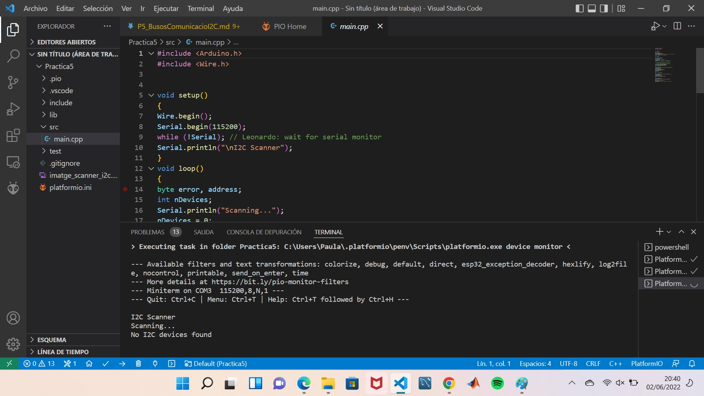

# **PRÀCTICA 5: BUSOS DE COMUNICACIÓ I**
## **PART A: Escanner I2C** 
### **5.1 Codi**
```c++

    #include <Arduino.h>  
    #include <Wire.h>  


    void setup() {  
        Wire.begin();  
        Serial.begin(115200);  
        while (!Serial);  
        Serial.println("\nI2C Scanner");  
    }   
    void loop(){  
        byte error, address;  
        int nDevices;  
        Serial.println("Scanning...");  
        nDevices = 0;  
        for(address = 1; address < 127; address++ )  
        {  
            // The i2c_scanner uses the return value of  
            // the Write.endTransmisstion to see if  
            // a device did acknowledge to the address.  
            Wire.beginTransmission(address);  
            error = Wire.endTransmission();  
            if (error == 0)  
            {  
                Serial.print("I2C device found at address 0x");  
                if (address<16)  
                Serial.print("0");  
                Serial.print(address,HEX);  
                Serial.println(" !");  
                nDevices++;  
            }  
            else if (error==4)  
            {  
                Serial.print("Unknown error at address 0x");  
                if (address<16)  
                Serial.print("0");  
                Serial.println(address,HEX);  
            }  
        }  
        if (nDevices == 0)  
        Serial.println("No I2C devices found\n");  
        else  
        Serial.println("done\n");  
        delay(5000); // wait 5 seconds for next scan  
    } 
``` 

### **5.2 Funcionament**

És un codi que té la funcionalitat d'escanejar per comprovar si hi ha algun perifèric i2C connectat al microcontrolador ESP32.  

Compta amb un bucle en el void loop() en el que s'inicia el proces i es va escanejant de forma periòdica l'existència d'un dispositiu I2C, de manera que mentrestant per pantalla apareixerà el missatge "scanning...". L'scanner de dispositius i2c utilitza el retorn del valorWire.endTransmission() per comprovar si el dispositiu reconeix l'adreça.

Un cop escanejat si en troba algun apareixerà per pantalla un missatge informant que ha trobat un I2C i la seva adreça. En cas contrari posarà que no s'ha considerat cap dispositiu.



## **PART B: Dispositiu i2C**
### **5.3 Codi**

````c++
#include <Arduino.h>  
#include <LiquidCrystal_I2C.h>  
#include <Wire.h>  
#include "RTClib.h"  
#include<SPI.h>  

    RTC_DS1307 rtc;  

    int segundo,minuto,hora,dia,mes;  
    long anio; //variable año  
    DateTime HoraFecha;  

    // set the LCD number of columns and rows  
    int lcdColumns = 16;  
    int lcdRows = 2;  

    // set LCD address, number of columns and rows  
    // if you don't know your display address, run an I2C scanner sketch  
    LiquidCrystal_I2C lcd(0x27, lcdColumns, lcdRows);    

    void setup(){  
        Serial.begin(115200);  
        rtc.begin(); //Inicializamos el RTC  
        // initialize LCD  
        lcd.init();  
        // turn on LCD backlight                        
        lcd.backlight();  
    }  

    void loop(){  
        HoraFecha = rtc.now(); //obtenemos la hora y fecha actual  
        segundo=HoraFecha.second();  
        minuto=HoraFecha.minute();  
        hora=HoraFecha.hour();  
        dia=HoraFecha.day();  
        mes=HoraFecha.month();  
        anio=HoraFecha.year();  

        // set cursor to first column, first row  
        lcd.setCursor(0, 0);  
        // print message  
        lcd.print("hora = ");  
        lcd.print(hora);  
        lcd.print(":");  
        lcd.print(minuto);  
        lcd.print(":");  
        lcd.print(segundo);  
        lcd.print("  Fecha = ");  
        lcd.print(dia);    
        lcd.print("/");  
        lcd.print(mes);  
        lcd.print("/");  
        lcd.print(anio);  
        lcd.println();  
        delay(1000);  
        // clears the display to print new message  
        lcd.clear();  
        // set cursor to first column, second row  
        //lcd.setCursor(0,1);  
        //lcd.print("Hello, World!");  
        //delay(1000);  
        //lcd.clear();   
    } 
```` 

### **5.4 Funcionament**
El programa compta amb un rellotge i una pantalla display per tal de mostrar pel display l'hora i la data. El codi inicialitza el rellotge RTC i la pantalla LCD en el void setup(), així com encen la llum de fons en el display. Seguidament en el bucle, void loop(), s'obté l'hora i la data amb el rellotge RTC amb la comanda HoraFecha = rtc.now() i es carrega el missatge que s'imprimirà per pantalla al display. Finalment, ens apareixerà pel display l'hora i la data amb el següent format: "Hora = hora:minut:segon Fecha = dia/mes/any".

El video de demostració esta penjat al github.
